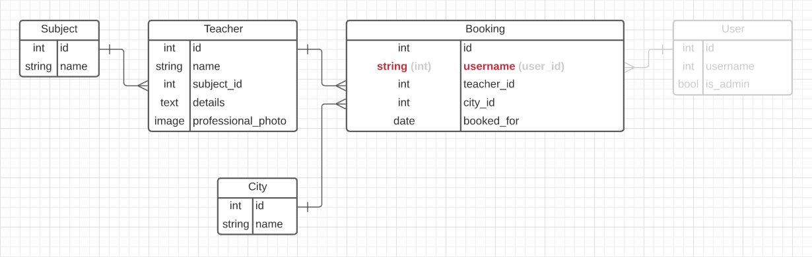

# Book a Teacher

> Book a Teacher is a web app to schedule a time with an online teacher!


Access the Front-end of the web app by [clicking here](https://github.com/arthurborgesdev/book-a-teacher-webapp).

## Group Size

Size of the Team: 2 people

## Built With

- React
- Redux Toolkit
- Ruby on Rails


## Getting Started

To get a local copy up and running follow these simple example steps.

### Prerequisites

- A github account signed in in your terminal
- PostgreSQL
- NPM
- Ruby

### Setup

Rails
- `git clone https://github.com/fernandorpm/book-a-teacher-api.git`
- `cd book-a-teacher-api`

React
- `git clone https://github.com/fernandorpm/book-a-teacher-webapp.git`
- `cd book-a-teacher-webapp`

### Install

Rails
- `bundle install`
- `rails db:setup`
- `rails db:migrate`
- `rails db:seed`

React
- `npm install`

## Usage
### Web App
To use this API as part of the web app, please refer to [this repo](https://github.com/arthurborgesdev/book-a-teacher-webapp).


### API
Documentation:
`http://localhost:3000/api-docs`

### Teachers Routes
```ruby
GET
/api/v1/teachers
# Returns a list of teachers

GET
/api/v1/teachers/{:id}
# Returns the teacher with the {:id} provided by the params with their details

POST
/api/v1/teachers
# Creates a new Teacher
# Body: 
{
  "name": "Your Name",
  "subject_id": 1,
  "details": "You're cool!"
}


DELETE
/api/v1/teachers/{:id}
# Deletes the Teacher with the {:id} provided by the params


```

### Bookings Routes
```ruby
GET
/api/v1/bookings
# Returns a list of bookings scheduled

POST
/api/v1/bookings
# Creates a new Booking
{
  "username": "fernandorpm",
  "teacher_id": 9,
  "city_id": 1,
  "booked_for": "2020-10-12"
}

DELETE
/api/v1/bookings/{:id}
# Deletes the Booking with the {:id} provided by the params

```

### Cities Routes
```ruby
/api/v1/cities
# Returns a list of cities
```

### Subjects Routes
```ruby
/api/v1/subjects
# Returns a list of subjects
```


## Kanban Board
Access the project's kanban and progress [here](https://github.com/fernandorpm/book-a-teacher-api/projects/1).

You can check the initial state of the Kanban Board on the [Issue Final Group Capstone - Book a Teacher](https://github.com/fernandorpm/book-a-teacher-api/issues/23).

## Database ERD
This project **_does not_** contain the user table and authentication as it wasn't a requirement and we had to work on a strict deadline.

Therefore, we adapted the relationship between Users and Teachers (Bookings) to be made directly by the username.


## Authors

👤 **Fernando R P Marques**

- GitHub: [@fernandorpm](https://github.com/fernandorpm)
- Twitter: [@rpm_fernando](https://twitter.com/rpm_fernando)
- LinkedIn: [Fernando R P Marques](https://linkedin.com/in/fernandorpm)

👤 **Arthur Borges**

- GitHub: [@arthuborgesdev](https://github.com/arthurborgesdev)
- Twitter: [@arthurmoises](https://twitter.com/arthurmoises)
- LinkedIn: [Arthur Borges](https://linkedin.com/in/arthurmoises)


## 🤝 Contributing

Contributions, issues, and feature requests are welcome!

Feel free to check the [issues page](../../issues/).

## Show your support

Give a ⭐️ if you like this project!

